## Hi there 👋

###

## About me

- __Area:__ Web Dev Fullstack
- __University:__ Federal University of São Carlos (UFSCar) - CompSci
- __Working at:__ CERN

## Favorite stack

  
  
  
  
  
  
  
  

## Stats

  
  

